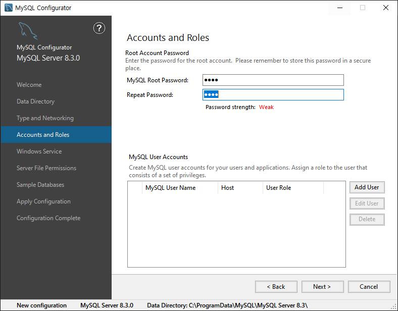
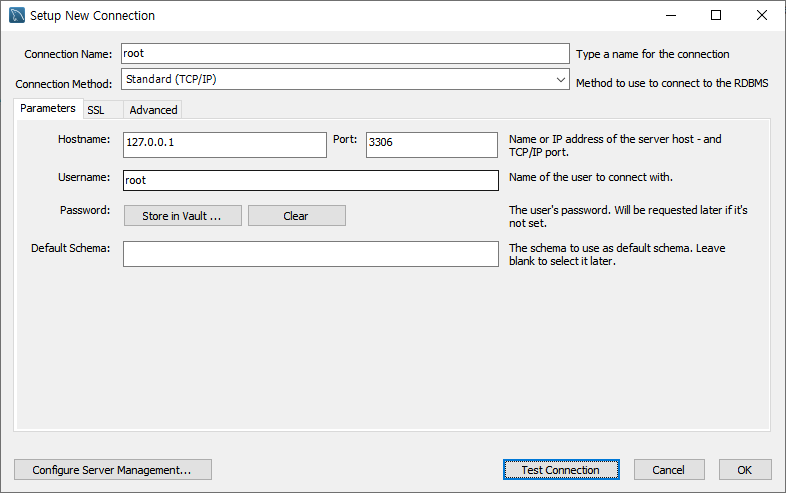

### [전체 목차](../../README.md)
### [이전 페이지](../README.md)

# 8 일차

- MySQL 설치
- DDL: `CREATE`, `ALTER`, `DROP`, `TRUNCATE`

## 목차

- [MySQL 설치](#mysql-설치)
- [DDL](#ddl)
    - 사용자 계정 생성
    - 데이터베이스 생성
    - 테이블 생성
    - 테이블 삭제

## [MySQL 설치](#목차)

- 서버 생성


- 서버 연결



## DDL

DDL(Data Definition Language) – CREATE, ALTER, DROP, TRUNCATE
- Database 스키마(Database, Table, View, Index 등 object)를 생성, 삭제, 수정하는 언어
- DDL은 트랜잭션이 발생하지 않아 명령어를 실행하면 Rollback 시킬 수 없다.

### 사용자 계정 생성

```sql
--  로컬 계정 생성
CREATE user scott@localhost IDENTIFIED BY 'tiger';

-- 등록된 사용자 계정 조회
SELECT user, host from mysql.user;

-- scott 계정에 권한 부여 - grant *.* 모든 DB, 모든 테이블
GRANT ALL PRIVILEGES on *.* to scott@localhost;
```

> ```
> user              host
> mysql.infoschema  localhost
> mysql.session     localhost
> mysql.sys         localhost
> root              localhost
> scott             localhost
> ```

### 데이터베이스 생성

```sql
--  데이터베이스 생성
CREATE DATABASE test;

-- 데이터베이스들 확인
SHOW DATABASES;

-- 사용할 데이터베이스 선택
USE test;
```

```
Database
information_schema
mysql
performance_schema
sys
test
```

### 테이블 생성

```sql
--  테이블 생성
CREATE TABLE member (
	ID VARCHAR(10) PRIMARY KEY,
    PASSWORD VARCHAR(10) NOT NULL,
    NAME VARCHAR(50) NOT NULL,
    EMAIL VARCHAR(100) UNIQUE, -- 중복된 값을 가질 수 없다. 
    AGE INT NOT NULL CHECK(AGE > 0),
    CREATE_AT TIMESTAMP NOT NULL DEFAULT CURRENT_TIMESTAMP 
    -- 값이 들어가는 시점의 일시를 디폴트 값으로 저장 
);

-- 테이블들 확인
SHOW TABLES;

-- 테이블의 컬럼 등 정보조회
DESC member;
```

### 테이블 삭제

```sql
-- 테이블 삭제
DROP TABLE member;
DROP TABLE IF EXISTS member;

SHOW TABLES;
```


### [목차로 돌아가기](#목차)
## [이전 페이지](../README.md)
