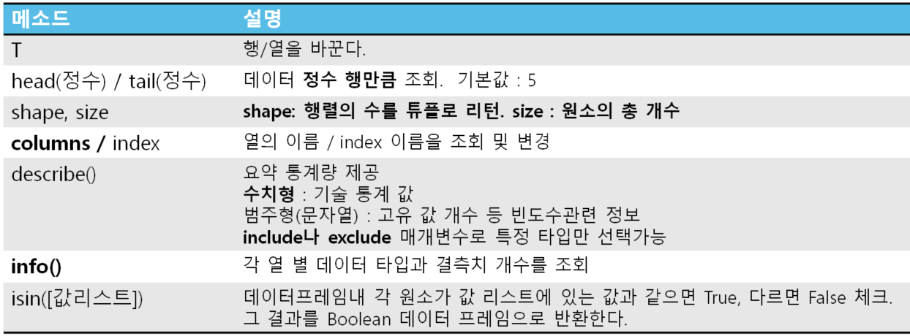

### [전체 목차](../../README.md)
### [이전 페이지](../README.md)

# 13 일차

데이터 집계

## 목차

- [Pandas](#pandas)


## [Pandas](#목차)

- 데이터 분석과 관련된 다양한 기능을 제공하는 파이썬 패키지
    - 데이터 셋을 이용한 다양한 통계 처리 기능을 제공한다.
    - 표 형태의 데이터를 다루는데 특화된 파이썬 모듈
    - **시리즈(Series)** 와 **데이터프레임(DataFrame)** 클래스 제공
        - Series: 1차원 자료구조를 표현
        - DataFrame: 2차원 행렬구조의 표(table)를 표현

## [Series](#목차)

- **1차원** 자료구조
- DataFrame(표)의 **한 행(row)** 이나 **한 열(column)** 을 표현한다.
- 각 원소는 **index**와 **index 이름**을 가지며 그것들을 이용해 사용할 수 있다.
- 벡터화 연산(element-wise 연산)을 지원
    - Series 객체에 연산을 하면 각각의 Series 원소들에 연산이 된다.
- 구문
    - `Series(1차원의 iterable)`
    - 1차원 구조의 자료구조에 값을 넣어 생성한다.
        - list, tuple, ndarray 등

```py
s1 = pd.Series([1,2,3,4])
s1
# index 이름: 0 1 2 3,
# 값: 1 2 3 4
> 0    1
> 1    2
> 2    3
> 3    4

# index name 조회
s1.index
> RangeIndex(start=0, stop=4, step=1)

s2 = pd.Series([100,70,90], index=["국어","영어","수학"])
s2
> 국어    100
> 영어     70
> 수학     90

s2.index
> Index(['국어', '영어', '수학'], dtype='object')
```

### Indexing
- 한개의 원소를 조회하거나 변경할 때 사용
- **index (순번) 으로 조회**
    - `Series.iloc[순번]`
- **index 이름으로 조회**
    - `Series.loc[index 이름]`
    - index 이름의 타입에 맞춰 조회한다.
        - `s.loc['name'], s.loc[2]`
    - Series.index이름
- **팬시(fancy) 인덱싱**
    -`Series[index리스트]`
    - 한번에 여러개의 원소를 조회할 경우 조회할 index들을 list로 묶어서 전달한다.
        - `series[["A", "B", "C"]`

```py
s2.iloc[1], s2.iloc[-1]
s2.loc['국어'], s2.loc['수학']
s2[['국어','영어']]
```

### Slicing
- 범위로 원소들을 조회할 때 사용한다.
- **Series[start index :  stop index : step]**
    - start index 생략 : 0번 부터
    - stop index
        - **index 순번일 경우는 포함 하지는다.**
        - **index 명의 경우는 포함한다.**
- **Slicing의 결과는 원본의 참조(View)를 반환**
    - Slicing은 shallow copy를 한다. 원소를 변경하면 원본도 같이 바뀐다.
    - `slicing결과.copy()` 를 이용해 deep copy를 해야 한다.

>    - **deep copy(깊은 복사)**
>        - 원본과 동일한 값을 가진 새로운 객체(복사본)를 만들어 반환한다.
>        - 그래서 복사본의 값을 변경해도 원본이 변경되지 않는다.
>        - 리스트는 slicing 시 deep copy를 한다.
>    - **shallow copy(얕은 복사)**
>        - 원본을 반환하여 값 변경시 원본에 영향을 준다.
>        - Series, DataFrame, 넘파이 배열(ndarray)은 slicing 시 shallow copy 한다.
>    - **copy() 메소드**
>        - Series, DataFrame, ndarray를 복사한다.

```py
s3.iloc[10:15] # step: 1
> 10    10
> ...
> 14    14

s3.loc[10:15] # index 이름으로 slicing -> stop도 포함
> 10    10
> ...
> 15    15
```

```py
s2['국어'] = 60 # 값을 변경 (있는 index에 값을 대입)
s2['과학'] = 100 # 없는 index 이름으로 대입 -> 추가
s2
> 국어      60
> 영어      70
> 수학      90
> 과학     100

b = s2['영어':'과학']
b['수학'] = 10
s2
> 국어      60
> 영어      70
> 수학      10
> 과학     100
```

## [벡터화(연산)](#목차)
- Pandas의 Series나 DataFrame은 연산을 하면 원소 단위로 연산을 한다.
    - **element-wise 연산** 이라고도 한다.
- Series/DataFrame과 값(scalar값)을 연산하면 각 원소들과 값을 연산한다.
- Series끼리 또는 DataFrame끼리 연산을 하면 같은 위치의 원소끼리 연산을 한다.
    - **Index 이름**이 (index가 아닌) 같은 원소끼리 연산한다. 

```py
s10 = pd.Series([1,2,3,4,5,-10,-9,-8])
s10 * 10 # s10의 모든 원소에 연산처리
> 0     10
> 1     20
> ...
> 6    -90
> 7    -80

s10 < 0
> 0    False
> 1    False
> ...
> 6     True
> 7     True

s11 = pd.Series([10,20,30,40,50,-100,-90,-80])
# Series와 Series 연산 => 같은 index 이름끼리 계산
s10 + s11
> 0     11
> 1     22
> ...
> 6    -99
> 7    -88
```


## [Boolean 인덱싱](#목차)
- Series의 indexing 연산자에 boolean 리스트를 넣으면 True인 index의 값들만 조회한다. 
    - **원하는 조건의 값들을 조회**할 때 사용한다.

|논리연산자|설명|
|:-:|-|
|&|and연산|
|\||or연산|
|~|not 연산|
    
    - 논리연산자의 피연산자들은 반드시 ( )로 묶어준다.
    - 파이썬과는 다르게 `and`, `or`, `not`은 예약어는 사용할 수 없다.

```py
s2[[True, False, False]] # True인 index에 있는 값들을 조회
> 국어    100

s2[s2 >= 80]
> 국어    100
> 수학     90

s10[~((s10 >= 2) & (s10 <= 10))]
> 0     1
> ...
> 7    -8

s10.between(2, 10) # 원소별로 2~10 사이에 있는지 확인
> 0    False
> 1     True
> ...
> 7    False

s10[~s10.between(2, 10)]
> 0     1
> ...
> 7    -8

s10[s10.between(2, 10)].index
np.where(s10.between(2, 10))
> Index([1, 2, 3, 4], dtype='int64')

np.where(s10.between(2, 10), '범위안', '범위밖')
> array(['범위밖', '범위안', ..., '범위밖'], dtype='<U3')
```

> - 한개의 원소를 조회할 경우
>     - indexing
> - 여러개의 원소를 선택해서 조회할 경우
>     - fancy indexing
> - 특정 조건의 원소들을 조회할 경우
>     - boolean indexing 

## [Series 메소드, 속성](#목차)


## [결측치](#목차)
- 모르는 값, 수집이 안된 값, 현재 가지고 있지 않은 값
- None, numpy.nan, numpy.NAN
- 결측치는 float 타입으로 처리된다.
    
### 결측치 확인
- 각 함수/메소드는 각 원소 별로 결측치인지 확인해서 결과를 반환한다.
- Numpy
    - np.isnan(배열)
    
```python
import numpy as np
a = np.array([1,np.nan])
np.isnan(a)
```

- Series/DataFrame
    - Series/DataFrame객체.isnull() 또는 isna()
    - Series/DataFrame객체.notnull() 또는 notna()

### 결측치 처리

- 제거 
    - dropna()
- 다른 값으로 대체 
    - fillna()
        - 평균, 중앙값, 최빈값을 주로 사용


## [DataFrame](#목차)
- **표** 를 다루는 Pandas의 타입
- **행(row)와 열(column)** 으로 구성되어 있다.
- 각 행과 각 열은 식별자를 가진다.
    - **순번**
        - 양수, 음수 index 두가지를 가진다.
    - **이름**
        - 명시적으로 지정한 행과 열의 이름을 말한다.
        - index name과 column name은 **중복될 수 있다.**
- 하나의 행과 하나의 열은 Series로 구성된다.

### DataFrame 생성
- `pd.DataFrame(data [, index=None, columns=None])`
    - data 
        - DataFrame을 구성할 값을 설정
            - Series, List, ndarray를 담은 2차원 배열
            - 열이름을 key로 컬럼의 값 value로 하는 딕션어리(사전)
    - index
        - index명으로 사용할 값 배열로 설정
    - columns
        - 컬럼명으로 사용할 값 배열로 설정

```py
# 중첩 리스트(튜플) 이용해서 사용 -> list 안에 list
d1 = pd.DataFrame([[10, 20, 30],
                   [100, 200, 300],
                   [1, 2, 3]],
                  columns=["C1","C2","C3"],
                  index=["I1","I2","I3"])

"""
C1	C2	C3
I1	10	20	30
I2	100	200	300
I3	1	2	3
"""

# dictionary 이용 생성 {"컬럼명":[컬럼에 들어갈 값들]}
d = {
    "id":['id-1','id-2','id-3','id-4','id-5'],
    "korean":[100,50,70,60,90],
    "english":[90,80,100,60,40]
} # 리스트 원소 개수는 모두 동일해야 함
grade = pd.DataFrame(d)

"""
id	korean	english
0	id-1	100	90
1	id-2	50	80
2	id-3	70	100
3	id-4	60	60
4	id-5	90	40
"""
```

### DataFrame 파일 저장

- **`DataFrame객체.to_저장형식()`**
- CSV 파일로 저장
    - `DataFrame객체.to_csv(파일경로, sep=',', index=True, header=True)`
    - encoding 방식: UTF-8 로 저장된다.
- 엑셀로 저장
    - `DataFrame객체.to_excel(파일경로, index=True, header=True)`
- 기타 형식
    - `grade.to_pickle("saved_data/grade.pkl")`
    - `grade.to_html("saved_data/grade.html")`

### 데이터셋 읽기
- `pd.read_csv(파일경로, sep=',', header, index_col, na_values)`
```py
df8 = pd.read_excel("saved_data/grade1.xlsx", index_col=0)
df9 = pd.read_pickle("saved_data/grade.pkl")
df_list = pd.read_html("saved_data/grade.html")
wc_df = pd.read_html("https://ko.wikipedia.org/wiki/FIFA_%EC%9B%94%EB%93%9C%EC%BB%B5")

# select 결과를 DataFrame으로 로딩
conn = pymysql.connect(host='127.0.0.1', port=3306,
                       user='scott', password='tiger', db='hr_join')
emp_sql = "select * from emp"
emp_df = pd.read_sql(emp_sql, conn)
conn.close()
```

## [Dataframe 메소드, 속성](#목차)




### 컬럼이름/행이름 변경   

- columns와 index 속성으로는 통째로 바꾸는 것은 가능하나 일부만 선택해서 변경하는 것은 안된다.
    - `df.columns = ['새이름','새이름', ... , '새이름']`
    - `df.columns[1] = '새이름'` 
        - 이런식으로 개별적으로 변경은 안된다.

- `DataFrame객체.rename(index=행이름변경설정, columns=열이름변경설정, inplace=False)`
    - **개별 컬럼이름/행이름 변경** 하는 메소드
    - 변경한 DataFrame을 반환
    - 변경설정: 딕셔너리 사용
        - {'기존이름':'새이름', ..}
        - inplace: 원본을 변경할지 여부(boolean)        

- `DataFrame객체.set_index(컬럼이름, inplace=False)`
    - 특정 컬럼을 행의 index 명으로 사용
    - 열이 index명이 되면서 그 컬럼은 Data Set 에서 제거된다.
- `DataFrame객체.reset_index(inplace=False)`
    - index를 첫번째 컬럼으로 복원

### [목차로 돌아가기](#목차)
## [이전 페이지](../README.md)

