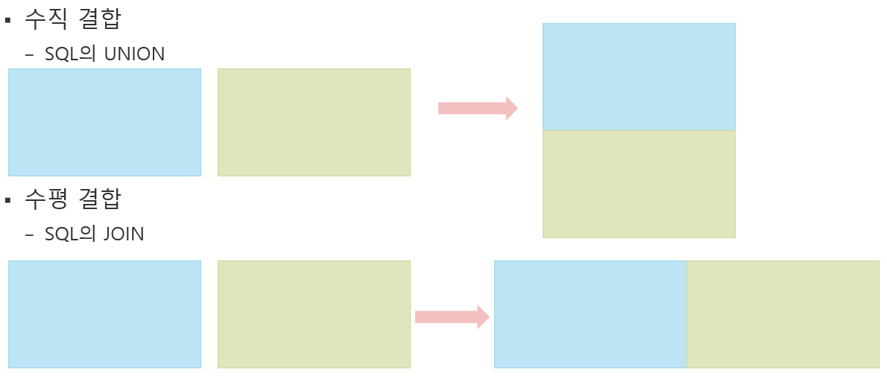

### [전체 목차](../../README.md)
### [이전 페이지](../README.md)

# 13 일차

데이터 합치기

## 목차

- [데이터프레임 합치기](#데이터프레임-합치기)
    - concat
    - join
    - merge


## [데이터프레임 합치기](#목차)
- 두 개 이상의 DataFrame을 합쳐 하나의 DataFrame으로 만든다.



- **수직결합**
    - 단순 결합으로 여러 개의 DataFrame들의 같은 컬럼끼리 수직으로 합친다.
    - **컬럼명이 같은 열끼리 합친다.**
    - 같은 column 명이 없는 열들도 결과 DataFrame에 들어간다.(default)
        - full outer join개념
- **수평결합**
    - JOIN은 합치려는 DataFrame들의 index 나 특정 컬럼의 값이 같은 행 끼리 합친다.
    - **index명이 같은 행 끼리 합친다.** (equi-join)
    - 같은 index명이 없는 행들도 결과 DataFrame에 들어간다.(default)
        - full outer join

### concat
- 수직, 수평 결합 모두 지원한다.
> - pd.concat(objs,  [, key=리스트]), axis=0, join='outer')
>    - 매개변수
>        - objs: 합칠 DataFrame들을 리스트로 전달
>        - keys=[] 를 이용해 합친 행들을 구분하기 위한 다중 인덱스 처리
>        - join: 
>            - 'outer'(기본값): full outer join
>            - 'inner': inner join (동일한 index명, column명 끼리 합친다.)

```py
# 2016, 2017, 2018 stock DF 합치기
result = pd.concat([stock_2016,stock_2017,stock_2018])
# 행이 늘어나도록 합친다. (수직결합) -> 같은 컬럼명끼리 합친다.

"""
  Symbol  Shares  Low  High
0   AAPL      80   95   110
1   TSLA      50   80   130
2    WMT      40   55    70
...
0   AAPL      40  135   170
1   AMZN       8  900  1125
2   TSLA      50  220   400
"""
```

```py
# axis='columns': 컬럼이 늘어나도록 붙인다. 행이름(index name)이 같은 행끼리 합친다.
result = pd.concat([stock_2016,stock_2017,stock_2018], axis='columns', join='inner')

"""
  Symbol  Shares  Low  High Symbol  Shares  Low  High Symbol  ...
0   AAPL      80   95   110   AAPL      50  120   140   AAPL  ...
1   TSLA      50   80   130     GE     100   30    40   AMZN  ...
2    WMT      40   55    70    IBM      87   75    95   TSLA  ...
"""
```

```py
# 기존 index name을 버리고 읽기 -> 자동증가 index로 변경
result = pd.concat([stock_2016,stock_2017,stock_2018], ignore_index=True)

"""
   Symbol  Shares  Low  High
0    AAPL      80   95   110
1    TSLA      50   80   130
2     WMT      40   55    70
...
9    AAPL      40  135   170
10   AMZN       8  900  1125
11   TSLA      50  220   400
"""
```

```py
# 기존 index name을 버리고 읽기 -> 자동증가 index로 변경
result = pd.concat([stock_2016,stock_2017,stock_2018], keys=['2016','2017','2018'])

"""
       Symbol  Shares  Low  High
2016 0   AAPL      80   95   110
     1   TSLA      50   80   130
     2    WMT      40   55    70
...
2018 0   AAPL      40  135   170
     1   AMZN       8  900  1125
     2   TSLA      50  220   400
"""
```


### join
- 두 개 이상의 데이터프레임을 특정 컬럼(열)의 값이 같은 행끼리 `수평결합` 하는 것
    - **조인 기준**: index가 같은 값인 행끼리 합친다. (equl-join)
- Inner Join, Left Outer Join, Right Outer Join, Full Outer Join
- 연관성있는 둘 이상의 DataFrame을 하나로 합친다.
    - ex) 고객과 주문정보, 교수와 수업정보, 직원과 부서정보

> - dataframe객체.join(others, how='left', lsuffix='', rsuffix='') 
>    - `df_A.join(df_b)`, `df_A.join([df_b, df_c, df_d])`
> - 매개변수
>    - lsuffix, rsuffix
>        - 같은 이름이 있는 경우 붙일 접미어 지정

```py
# 연관성 있는 컬럼을 index name으로 만들고 join 한다.
stock_info.set_index("Symbol").join(stock_2016.set_index("Symbol"))

"""
                                           Name  Shares   Low   High
Symbol                                                              
AAPL                                  Apple Inc    80.0  95.0  110.0
TSLA                                  Tesla Inc    50.0  80.0  130.0
WMT                                 Walmart Inc    40.0  55.0   70.0
GE                             General Electric     NaN   NaN    NaN
IBM     IBM(International Business Machines Co)     NaN   NaN    NaN
SLB                       Schlumberger Limited.     NaN   NaN    NaN
TXN              Texas Instruments Incorporated     NaN   NaN    NaN
AMZN                            Amazon.com, Inc     NaN   NaN    NaN
"""
```

```py
stock_info.set_index("Symbol").join(stock_2016.set_index("Symbol"), how='right')

"""
               Name  Shares  Low  High
Symbol                                
AAPL      Apple Inc      80   95   110
TSLA      Tesla Inc      50   80   130
WMT     Walmart Inc      40   55    70
"""
```

```py
stock_2016.set_index("Symbol").join(stock_2018.set_index("Symbol"),
                                    lsuffix='_2016', rsuffix="_2018", how="outer")

"""
        Shares_2016  Low_2016  High_2016  Shares_2018  Low_2018  High_2018
Symbol                                                                    
AAPL           80.0      95.0      110.0         40.0     135.0      170.0
AMZN            NaN       NaN        NaN          8.0     900.0     1125.0
TSLA           50.0      80.0      130.0         50.0     220.0      400.0
WMT            40.0      55.0       70.0          NaN       NaN        NaN
"""
```

```py
stock_2018_2 = stock_2018.set_index("Symbol").add_suffix("_2018")

"""
        Shares_2018  Low_2018  High_2018
Symbol                                  
AAPL             40       135        170
AMZN              8       900       1125
TSLA             50       220        400
"""
```


### merge
- `df_a.merge(df_b)`
- 두 개의 DataFrame간의 조인만 가능하다.
    - **조인 기준**
        - **같은 컬럼명**을 기준으로 equl-join을 하는 것이 기본이다.
        - **조인기준을 다양하게 정할 수 있다.**
            - 컬럼, index 등을 기준으로 같은 행끼리 join 하도록 설정할 수 있다.
><pre>
> dataframe.merge(합칠dataframe, how='inner', on=None,
>                 left_on=None, right_on=None,
>                 left_index=False, right_index=False)
></pre>
> - 매개변수
>    - on: 같은 컬럼명이 여러 개일때 join 대상 컬럼을 선택
>    - right_on, left_on: 조인할 때 사용할 왼쪽, 오른쪽 Dataframe의 컬럼명
>    - left_index, right_index: 조인할 때 index를 사용할 경우 True로 지정

```py
stock_2016.merge(stock_info)  # 기본: 같은 이름의 컬럼을 기준으로 join

"""
  Symbol  Shares  Low  High         Name
0   AAPL      80   95   110    Apple Inc
1   TSLA      50   80   130    Tesla Inc
2    WMT      40   55    70  Walmart Inc
"""
```

```py
stock_2016.merge(stock_info, how='right') # default: inner => right 

"""
  Symbol  Shares   Low   High                                     Name
0   AAPL    80.0  95.0  110.0                                Apple Inc
1   TSLA    50.0  80.0  130.0                                Tesla Inc
...
6    TXN     NaN   NaN    NaN           Texas Instruments Incorporated
7   AMZN     NaN   NaN    NaN                          Amazon.com, Inc
"""
```

```py
stock_2018_2.merge(stock_info, left_index=True, right_on="Symbol")

"""
   Shares_2018  Low_2018  High_2018 Symbol             Name
0           40       135        170   AAPL        Apple Inc
7            8       900       1125   AMZN  Amazon.com, Inc
1           50       220        400   TSLA        Tesla Inc
"""
```

```py
stock_2016.merge(stock_2018, on="Symbol", suffixes=["_16", "_18"])
# 같은 컬럼명 뒤에 붙일 접미어(default: _x, _y)
                
"""
  Symbol  Shares_16  Low_16  High_16  Shares_18  Low_18  High_18
0   AAPL         80      95      110         40     135      170
1   TSLA         50      80      130         50     220      400
"""
```


### [목차로 돌아가기](#목차)
## [이전 페이지](../README.md)

