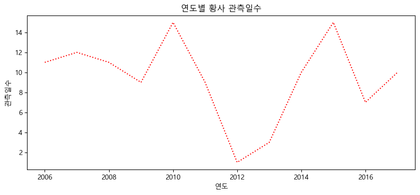
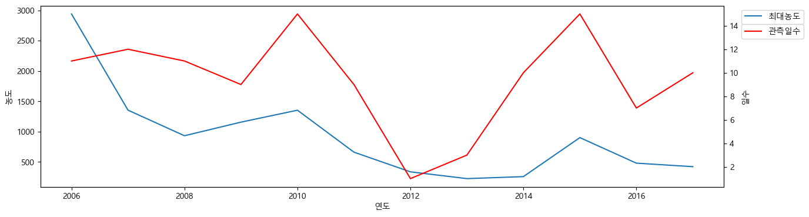
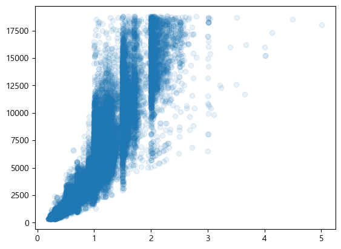
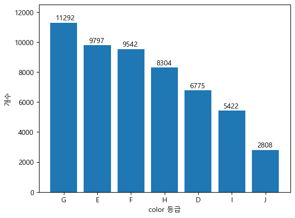
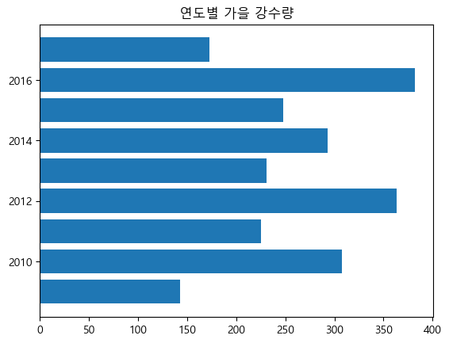
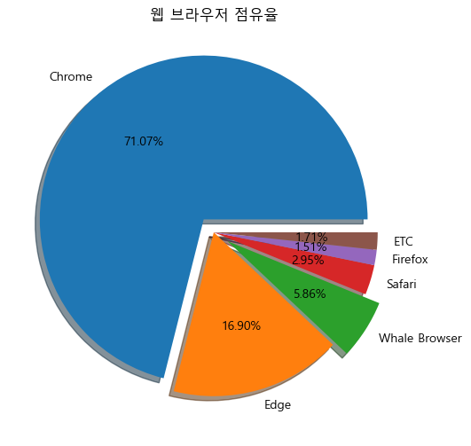
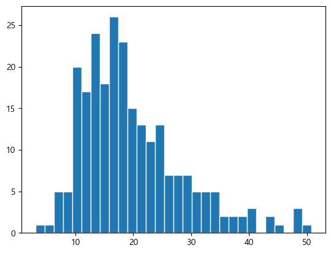
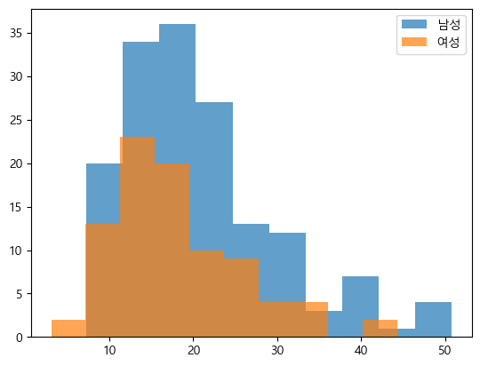
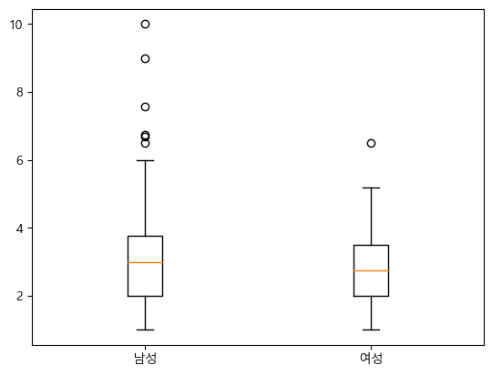

### [전체 목차](../../README.md)
### [이전 페이지](../README.md)

# 14-15 일차

EDA & 시각화

## 목차

- [선 그래프](#선-그래프)
- [산점도](#산점도)
- [막대그래프](#막대그래프)
- [파이차트](#파이차트)
- [히스토그램](#히스토그램)
- [상자그래프](#상자그래프)


## [선 그래프](#목차)

- 점과 점을 선으로 연결한 그래프
- 시간의 흐름에 따른 변화를 표현할 때 많이 사용한다. (시계열)
- `plot([x], y)` 
    - 1번인수 : x값(생략가능), 2번인수 y값
    - 인수가 하나인 경우 y 축의 값으로 설정되고 X값은 (0 ~ len(y)-1) 범위로 지정된다.
    - x와 y의 원소개수는 같아야 한다.
- 하나의 axes(subplot)에 여러 개의 선 그리기
    - 같은 axes에 plot()를 여러번 실행한다.
- 선 스타일
    - linestyle 속성에 설정

```py
import pandas as pd
import matplotlib.pyplot as plt

# 년도별 관측일수 변화
plt.figure(figsize=(10,4))
# line plot -> plot(x, y)
plt.plot(df.index, df['관측일수'], color='r', linestyle=':')
plt.title("연도별 황사 관측일수")
plt.xlabel("연도")
plt.ylabel("관측일수")
plt.show()
```



```py
# 주의보 발령횟수와 경보 발령횟수의 흐름 비교
plt.plot(df.index, df['주의보 발령횟수'], alpha=0.5, label="주의보")  #  alpha : 투명도 (0~1)
plt.plot(df.index, df['경보 발령횟수'], alpha=0.5, label="경보")
plt.title("주의보/경보 발령횟수 흐름")

# 눈금(ticks) 변경 : xticks(), yticks() -> 눈금 위치, label 설정
plt.xticks(df.index, rotation=45)
plt.yticks(range(5))

plt.legend()
plt.show()
```

### 하나의 축을 공유하고 두개의 축을 가지는 그래프

- 값의 범위(Scale)이 다른 두 값과 관련된 그래프를 한 Axes(subplot)에 그리는 경우
- X축을 공유해 2개의 Y축을 가지는 그래프
    - axes.twinx() 를 이용해 axes를 복사
- Y축을 공유해 2개의 X축을 가지는 그래프
    - axes.twiny() 를 이용해 axes를 복사

```py
# 최대 농도와 관측일 수의 연도별 변화
## x축은 공유, y축을 나눠서 최대농도와 관측일수 표현

# axes(subplot) 조회
ax1 = plt.gca()  # get current axes
ax2 = ax1.twinx()

ax1.plot(df.index, df['최대농도'], label="최대농도")
ax1.set_xlabel("연도")
ax1.set_ylabel("농도")

#loc=("상하위치(upper, center,lower) 좌우위치(left center right)")  
# 정가운데 : center,  최적 위치 : best
# ax1.legend(loc="upper center") 
# bbox_to_anchor와 loc를 같이 사용 -> 원하는 위치에 지정
# bbox_to_anchor는 legend 박스를 그리기 시작할 점의 위치
# loc은 legend box의 어느 부분을 bbox_to_anchor에 위치할 것인지 지정
ax1.legend(bbox_to_anchor=(1.02,1), loc="upper left")
ax2.plot(df.index, df['관측일수'], label="관측일수", color='r')
ax2.set_ylabel("일수")
ax2.legend(bbox_to_anchor=(1.02,0.92), loc="upper left")
plt.show()
```



## [산점도](#목차)

- X와 Y축을 가지는 좌표평면상 관측값들을 점을 찍어 표시하는 그래프
- 변수(Feature)간의 상관관계(상관계수) 관측값들 간의 군집 분류를 확인할 수 있다.
- `scatter()` 메소드 사용
    - 1번인수 : x축 값, 2번인수 y축 값
    - x와 y값들을 모두 매개변수로 전달해야 한다.
        - x와 y의 원소의 수는 같아야 한다.
    - c/color: 색지정
        - c와 x, y와 같은 원소수를 가지는 Iterable 타입 객체로 설정할 경우 각 마커마다 다른 색상을 설정할 수 있다
    - s: 점 크기 지정
    - marker
        - marker란 점의 모양을 말하며 미리정의된 값으로 변경할 수있다.

```py
plt.scatter(df['carat'], df['price'], alpha=0.1)
```




## [막대그래프](#목차)

- 수량/값의 크기를 비교하기 위해 막대 형식으로 나타낸 그래프
- 범주형 데이터의 class별 개수를 확인할 때 사용
- bar(x, height) 메소드 사용
    - x : x값, height:  막대 높이
        - X는 분류값, height는 개수
- barh(y, width) 메소드
    - 수평막대 그래프
    - 1번인수: y값, 2번인수: 막대 너비  
- 매개변수
    - 첫번째: 수량을 셀 대상
    - 두번째: 수량

```py
v = df['color'].value_counts()
plt.bar(v.index, v)

for x,y in enumerate(v):
    plt.text(x-0.25, y+180, str(y))
 
plt.ylim(0, 12500)  # y의 범위

plt.xlabel("color 등급")
plt.ylabel("개수")
plt.show()
```



```py
plt.bar(df.columns, df.loc['여름'])
plt.title("연도별 여름 강수량")
plt.xticks(range(2009,2018), labels=[f"{y}년" for y in range(2009,2018)])
plt.show()

plt.barh(df.columns, df.loc['가을'])  # horizontal -> 수평 막대그래프
plt.title("연도별 가을 강수량")
plt.show()
```



## [파이차트](#목차)

- 전체 데이터량에서 각 범주(Category)가 차지하는 비율을 나타내는데 사용
- `pie(x, labels)` 이용
    - x: 값 (값들을 100을 기준으로 비율을 계산해 크기 설정)
    - labels : 값들의 label
    - autopct: 조각내에 표시될 비율의 문자열 형식. '%fmt문자' 
        - fmt문자: f(실수), d(정수), %% (%)

```py
plt.figure(figsize=(6,6))

plt.pie(web_df.loc['2023.01'],
        labels=web_df.columns,
        autopct="%.2f%%",
        explode=[0.1,0,0.1,0,0,0],
        shadow=True
       )
plt.title("웹 브라우저 점유율")
plt.show()
```




## [히스토그램](#목차) 

- 도수 분포표를 그래프로 나타낸 것.
    - 도수분포표: 연속형 자료를 특정 구간(bin)으로 나눠 그 빈도를 나타낸 표
        - 빈도 확인이나 **분포**를 볼때 사용한다.
    - X축: 계급(변수구간)의 대표값, Y축: 빈도수
- `hist(data [, bins=계급개수)` 메소드를 사용
    - data: 리스트형의 객체를 전달한다.

```py
plt.hist(tips['total_bill'], bins=30, edgecolor='w')  # 범위를 30등분
plt.show()
```



```py
plt.hist(tips[tips['sex']=='Male']['total_bill'], alpha=0.7, label="남성")
plt.hist(tips[tips['sex']=='Female']['total_bill'], alpha=0.7, label="여성")
plt.legend()
plt.show()
```




## [상자그래프](#목차) 

- 연속형 값들의 사분위수, 극단값들을 이용해 값들의 분포를 시각화한다.
- boxplot(x, whis=1.5)
    - x: 데이터셋
    - whis: 극단치 계산시 사용할 값(기본 1.5)
        - IQR을 이용해 극단치 계산하기
        - IQR(Inter Quatile Range): $3분위수 - 1분위수$ 로 중간 50%값의 범위
        - 극단적으로 작은값: 1분위 - $IQR(3분위수-1분위수) * whis$   보다 작은 값들
        - 극단적으로 큰값: 3분위 + $IQR(3분위수-1분위수) * whis$  보다 큰 값들

```py
m_tip = tips.loc[tips['sex'] == 'Male', 'tip']
f_tip = tips.loc[tips['sex'] == 'Female', 'tip']
# 두 개 이상의 데이터들의 분포를 비교
plt.boxplot([m_tip, f_tip], labels=['남성', '여성'])

plt.show()
```




### [목차로 돌아가기](#목차)
## [이전 페이지](../README.md)