### [전체 목차](../../README.md)
### [이전 페이지](../README.md)

# 15 일차

15_Pandas 시각화

## 목차

- [막대그래프](#막대그래프)
- [그 외](#그-외)
    - 파이차트
    - 히스토그램
    - 밀도그래프
    - 상자그래프    
    - 산점도
    - Line plot

## [막대그래프](#목차)
- index가 무슨 값인지를 가리키는 축으로 사용된다. ==> 라벨로 사용

### plot()

- kind 매개변수에 지정한 값에 따라 다양한 그래프를 그릴 수 있다.
- **kind** : 그래프 종류 지정
    - **'line'**: line plot (default)
    - **'bar'**: vertical bar plot
    - **'barh'**: horizontal bar plot
    - **'hist'**: histogram
    - **'box'**: boxplot
    - **'kde'**: Kernel Density Estimation plot
    - **'pie'**: pie plot
    - **'scatter'**: scatter plot

```py
import pandas as pd
import matplotlib.pyplot as plt

tips['sex'].value_counts().plot(kind='bar', # barh
                                title='제목',
                                ylabel='수량', 
                                rot=0)

tips['sex'].value_counts().plot.bar()
```

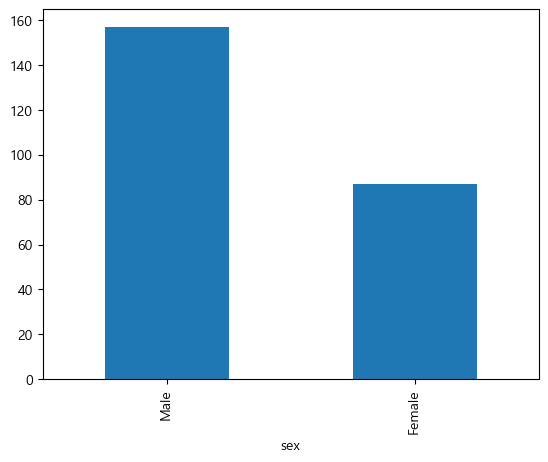

```py
df = tips.pivot_table(index='sex', columns='smoker', values='tip', aggfunc='count')
df.plot(kind="bar")
```

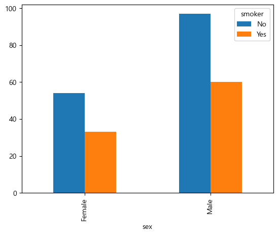

```py
tips.pivot_table(index='sex', columns='day', values='tip', aggfunc='count').\
            plot(kind='bar', stacked=True)
plt.legend(bbox_to_anchor=(1,1), loc='upper left', title='day')
plt.show()
```

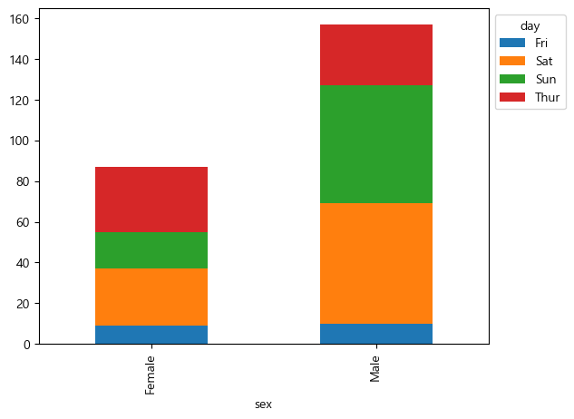

## [그 외](#목차)

### 파이차트

```py
v = tips['day'].value_counts()
v.plot(kind='pie', autopct="%.2f%%", explode=[0.2,0,0,0], shadow=True)
plt.show()
```

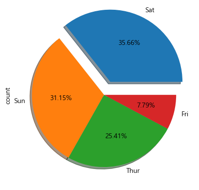

### 히스토그램

```py
tips['total_bill'].plot(kind='hist', bins=[0,10,20,30,60])
plt.show()
```

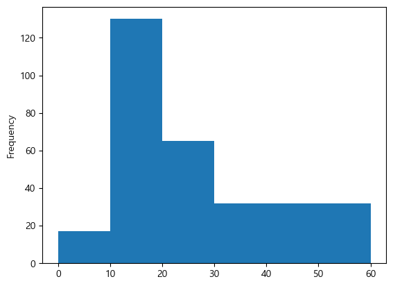

```py
tips[['total_bill', 'tip']].plot(kind='hist', alpha=0.6, bins=30)
plt.show()
```

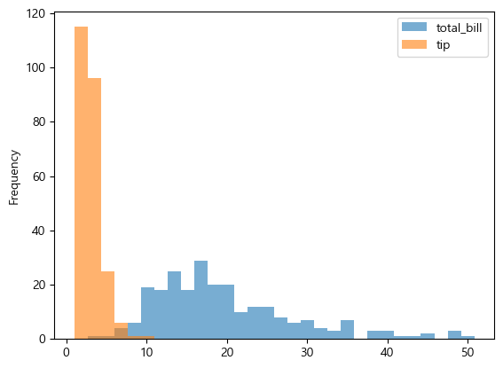

### KDE(밀도그래프)

```py
tips['total_bill'].plot(kind='kde')
plt.show()
```

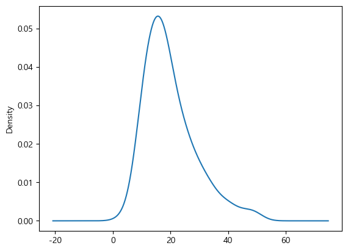

### Boxplot (상자그래프)

```py
tips['total_bill'].plot(kind='box', whis=3)
plt.show()
```

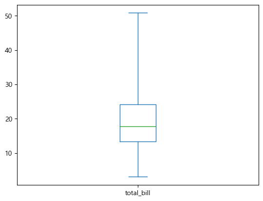

```py
tips[['total_bill', 'tip']].plot(kind='box')
plt.show()
```

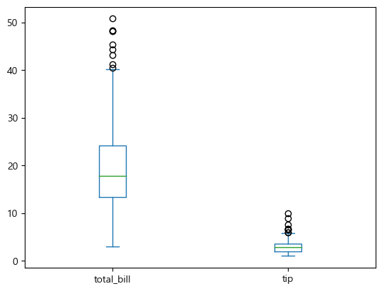

### scatter plot (산점도) 

```py
tips.plot(kind="scatter", x="total_bill", y="tip", alpha=0.6)
```

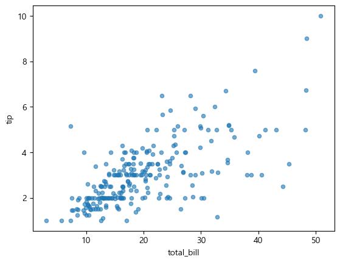

### Line plot

```py
df = pd.read_excel('data/강수량.xlsx',index_col=0)
df.plot(figsize=(15,4))
plt.show()
```

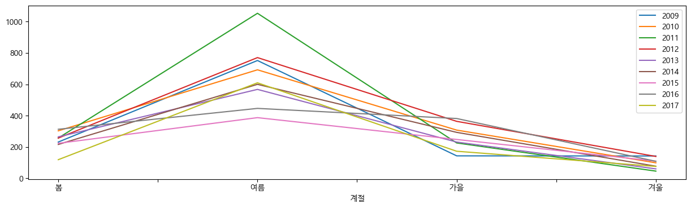

```py
df = pd.read_excel("data/강수량.xlsx", index_col="계절").T
df['봄'].plot(figsize=(15,4))
plt.show()
```

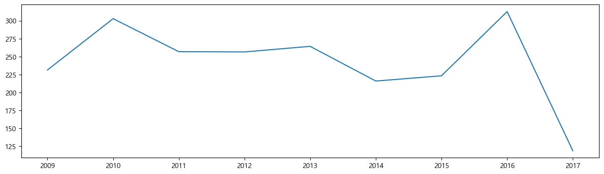

### [목차로 돌아가기](#목차)
## [이전 페이지](../README.md)