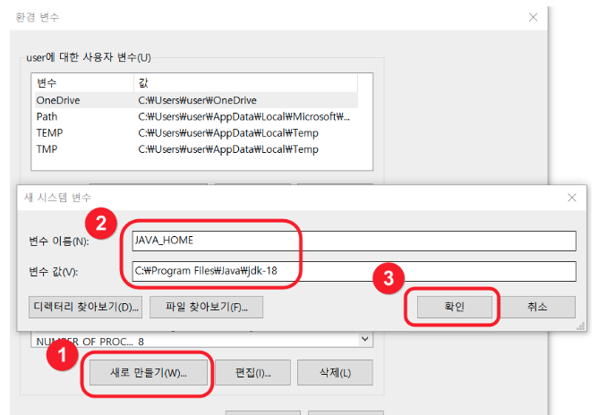
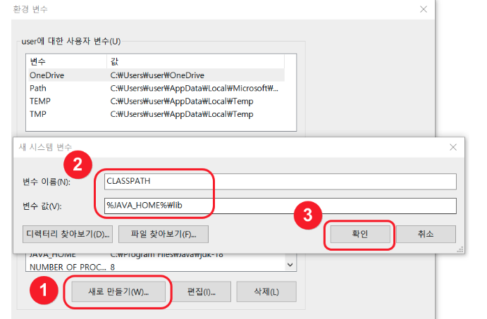
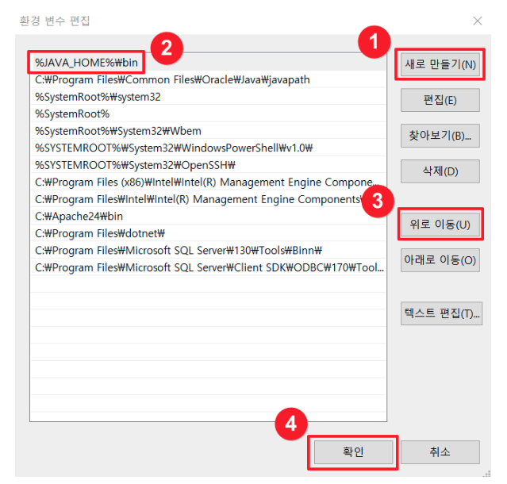
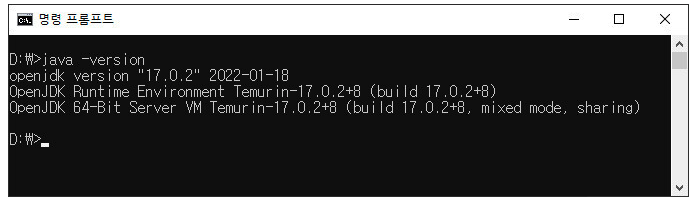
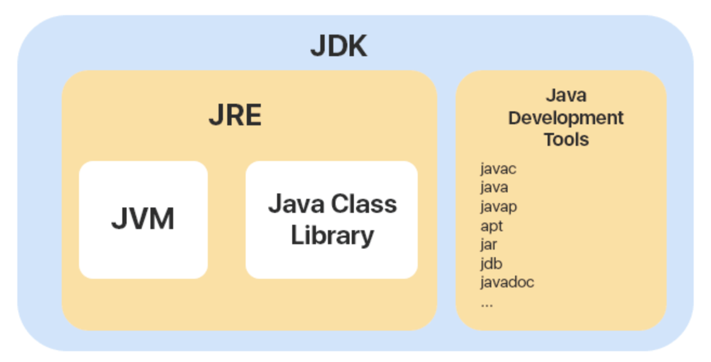
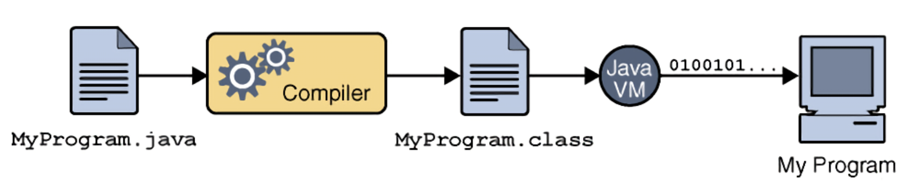

### [전체 목차](../../README.md)
### [이전 페이지](../README.md)

# 39 일차

- Java 설치
- Java 환경변수 설정
- vscode Java 세팅
- Java 장점

## 목차

- [Java 설치](#java-설치)
    - Java 환경변수 설정
    - vscode Java 세팅
- [사용법](#사용법)
- [Java 특징](#java-특징)
    - Java 장점
    - Java 실행 과정

## [Java 설치](#목차)

- [Adoptium용 다운로드](#https://adoptium.net/)
- [Oracle용 다운로드](#https://www.oracle.com/java/technologies/javase/jdk17-archive-downloads.html)

Adoptium용 jdk-17.0.8 LTS 설치  
Adoptium은 자동으로 환경변수 세팅  

> `LTS(Long Term Support): 장기 지원 버전`  
> 장기간에 걸쳐 업데이트 패치 등을 제공


### Java 환경변수 설정

>
> #### 1. jdk 설치 경로 복사
> #### 2. 시스템 환경변수
> #### 3. 새 시스템 변수 만들기  
> 
> 
>
> #### 4. Path 추가  
> 
>
> #### 5. Java 버전 확인  
> 

### vscode Java 세팅

- `Extension Pack for Java: Microsoft`
- `Spring Boot Extension Pack: VMware`
- Settings
    > Java > Debug > Setting: Console
    > internalConsole

## [사용법](#목차)

1. `명령 팔레트` 단축키: Ctrl + Shift + P
2. `>Java: Create Java Project...`
3. build 선택

```java
public class Main {
    // psvm + 탭: main 메소드 생성
    public static void main(String[] args) {

        // sout + 탭: print 메소드 생성
        System.out.println("Hello World");
    }
}

// Override 단축키: Ctrl + .
// 자동 import 단축키: Alt + Shift + o
```

## [Java 특징](#목차)

### Java 장점
- 자바는 운영체제와 독립적으로 실행
    - JVM을 통해서 독집적으로 실행

### JDK / JRE / JVM


JDK(Java Development Kit): 자바 개발키트
> 개발자들이 자바로 개발하는 데 사용되는 도구

JRE(Java Runtime Environment): 자바 실행환경
> JVM과 자바 프로그램을 실행할 때 필요한 라이브러리들이 있다.

JVM(Java Virtual Machine): 자바 가상머신
> 컴퓨터의 운영체제(윈도우, 리눅스 등)에 맞는 개발을 해야하지만, 자바는 JVM을 통해서 서로 다른 운영체제에서도 같은 코드로 동작할 수 있게 개발을 진행할 수 있다.

### Java 실행 과정



1. java 파일을 class 파일로 컴파일
2. JVM이 컴퓨터 운영체제가 이해할 수 있는 바이너리 코드로 변환
3. 실행


### [목차로 돌아가기](#목차)
## [이전 페이지](../README.md)
