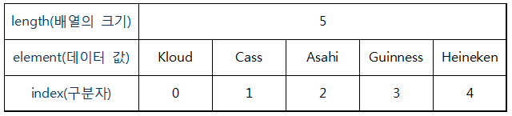

### [전체 목차](../../README.md)
### [이전 페이지](../README.md)

# 40 일차


## 목차

- [Array](#array)
- [List](#list)
- [ArrayList](#arraylist)
- [Map](#map)


## [Array](#목차)

- 동일한 자료형(Data Type)의 데이터를 연속된 공간에 저장하기 위한 자료구조



```java
// 자료형[] 변수 = {데이터1, 데이터2, 데이터3, ... };

String[] beer = {"Kloud", "Cass", "Asahi", "Guinness", "Heineken"};

System.out.println(beer[0]); // Kloud
System.out.println(beer[1]); // Cass

for (int i=0; i < beer.length; i++) {
  System.out.println(beer[i]);
}
```

```java
// 자료형[] 변수 = new 자료형[배열 크기];

int[] score = new int[3]; // 크기가 3인 배열 생성
score[0] = 10; // 0번 index에 값 할당
score[1] = 15; // 1번 index에 값 할당
score[2] = 13; // 2번 index에 값 할당

int sum = 0;
for (int i = 0; i < score.length; i++) { // score.length = 5
  sum += score[i]; // sum = sum + score[i];
}

double avg = (double) sum / score.length; // 형변환
System.out.println("점수 합계 : " + sum);
System.out.println("점수 평균 : " + avg);
```

## [List](#목차)

저장된 요소들의 순서가 있고 데이터에 중복이 가능하고 인덱스 번호에 의해서 정렬됩니다.

### 리스트의 특징

- 리스트는 크기 조절이 가능하다.
- 리스트는 초기 크기를 지정하지 않아도 된다.
- 리스트는 LinkedList와 ArrayList로 나눠진다.


```java
import java.util.ArrayList;  // ArratList 선언 시
import java.util.LinkedList; // LinkedList 선언 시
import java.util.List;

// 생성방법 
List<자료형> lst1 = new ArrayList<자료형(생략가능)>();
List<자료형> lst2 = new LinkedList<자료형(생략가능)>();

// 삽입 
lst1.add("1");
lst1.add(0, "2"); // 0번째에 "2" 삽입 
// 치환 
lst1.set(0, "5"); // 0번째에 "5"값으로 치환 
// 출력 
lst1.get(0); // 0번째 값 출력 
lst1.size(); // 리스트 크기 출력 
// 삭제 
lst1.remove(0); // 0번째 삭제 
lst1.clear(); // 모든 요소 삭제 
```

## [ArrayList](#목차)

- 요소를 순차적으로 추가하는 게 특징입니다.
- 배열은 배열 선언 시 크기도 같이 지정해 줘야 한다.
- ArrayList는 크기를 지정하지 않아도 되며 추가될 때마다 크기가 정해집니다.

```java
List<Integer> lst = new ArrayList<>();
// 데이터 타입 - random 클래스
Random ran = new Random();
for (int i = 0; i < 5; i++) {
  lst.add(ran.nextInt(30) + 1); // random에 +1을 안 해 주면 0 ~ 29까지만 사용된다.
}

lst.add(3, 35);
lst.set(0, 40);
lst.remove(4);

for (int i = 0; i < lst.size(); i++) {
  System.out.println(lst.get(i));
}
```

## [Map](#목차)

- Map 컬렉션 클래스들은 키와 값을 하나의 쌍으로 저장하는 방식(key-value 방식)을 사용합니다.  
키(key)란 실질적인 값(value)을 찾기 위한 이름의 역할을 합니다.

### Map 특징

- 요소의 저장 순서를 유지하지 않는다.
- key: 중복 허용 X
- value: 중복 허용 O

```java
// put메소드를 이용하여 입력한다.
Map<String, String> map = new HashMap<String, String>();
map.put("people", "사람");

// get 메소드를 이용하면 value값을 얻을 수 있다
System.out.println(map.get("people"));

// containsKey 메소드는 맵(Map)에 해당 키(key)가 있는지를 조사하여 그 결과값을 리턴한다.
System.out.println(map.containsKey("people"));

// size 메소드는 Map의 갯수를 리턴한다.
System.out.println(map.size());

// remove 메소드는 Map의 항목을 삭제하는 메소드로 key값에 해당되는 (key, value)을 삭제한 후 그 value 값을 리턴한다.
System.out.println(map.remove("people"));
```


### [목차로 돌아가기](#목차)
## [이전 페이지](../README.md)
