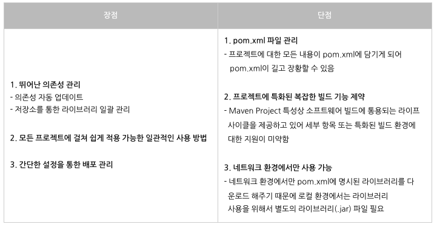
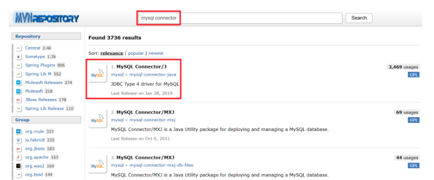
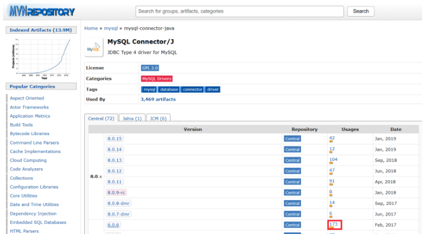
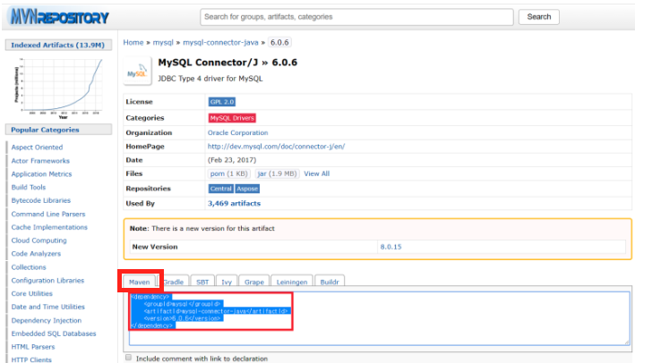
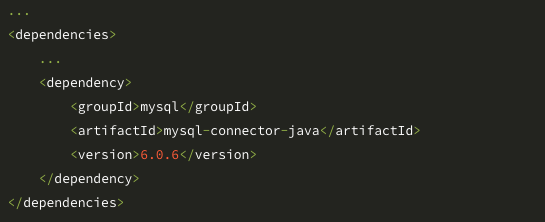
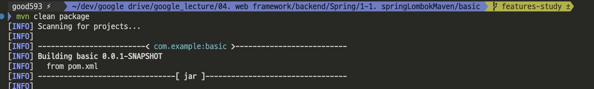
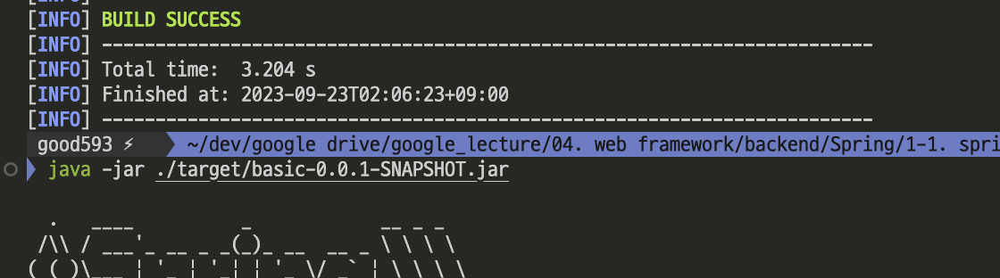
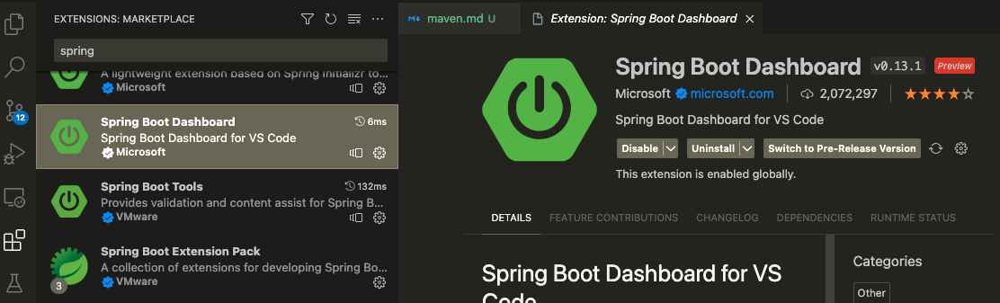
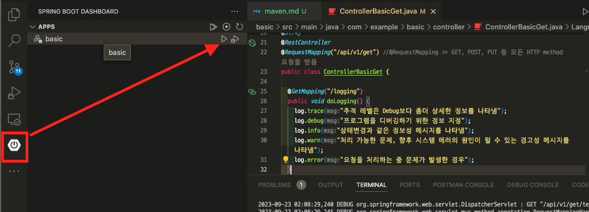

### [전체 목차](../../README.md)
### [이전 페이지](../README.md)

# 42 일차

- Maven, 라이브러리 의존성 주입, Build 예제

## 목차

- [Maven](#maven)
- [라이브러리 의존성 주입](#라이브러리-의존성-주입)
- [Maven Life-Cycle](#maven-life-cycle)
- [Maven Build 예제](#maven-build-예제)

## [Maven](#목차)

- Apache에서 개발한 자바 프로젝트의 빌드 자동화 도구 
- 라이브러리 의존성 관리를 위해 사용
    - 필요한 라이브러리들을 `POM(Project Object Model).xml`에 정의하면 자동으로 다운로드하여 프로젝트에 주입

### Maven 특징



### pom.xml 주요 속성

```xml
<project>
  <!-- 스프링부트 -->
  <parent>
    <groupId>org.springframework.boot</groupId>
    <artifactId>spring-boot-starter-parent</artifactId>
    <version>3.1.3</version>
    <relativePath/> <!-- lookup parent from repository -->
  </parent>

  <!-- 프로젝트 정보 -->
  <groupId>com.example</groupId>
  <artifactId>basic</artifactId>
  <version>0.0.1-SNAPSHOT</version> 
  <name>basic</name>
  <description>Demo project for Spring Boot</description>

  <!-- 프로젝트 자바버전  -->
  <properties>
    <java.version>17</java.version>
  </properties>

  <!-- 라이브러리들 -->
  <dependencies>
    <dependency>
      <groupId>org.springframework.boot</groupId>
      <artifactId>spring-boot-starter-web</artifactId>
    </dependency>
    ...
  </dependencies>

  <!-- 빌드 설정  -->
  <build>
    ...
  </build>
</project>
```

## [라이브러리 의존성 주입](#목차)

1. [Maven Repository](https://mvnrepository.com/) 접속 및 검색
> 

2. 알맞은 라이브러리 버전 선택 
> 

3. maven 설정 복사
> 

4. pom.xml에 붙여넣기
> 

## [Maven Life-Cycle](#목차)

```shell
# 기본 라이프 사이클
mvn compile # 소스코드를 컴파일 한다.
mvn test # 단위 테스트를 실행한다. (기본 설정은 단위 테스트가 실패하면 빌드 실패로 간주한다.)
mvn package # 컴파일된 클래스 파일과 리소르 파일들을 war 또느 jar와 같은 파일로 패키징한다.
mvn install # 패키징한 파일을 로컬 저장소에 배포한다. (USER_HOME/.m2/)
mvn deploy # 패키징한 파일을 원격 저장소에 배포한다.

# clean 라이프 사이클
mvn clean # 메이븐 빌드를 통해서 생성된 모든 파일들을 삭제한다.

# site 라이프 사이클
mvn site # 메이븐 설정 파일 정보를 활용하여 프로젝트에 대한 문서 사이트를 생성한다.
mvn site-deploy # 생성한 문서 사이트를 설정되어 있는 서버에 배포
```

## [Maven Build 예제](#목차)

### Maven Build 예제(1) 

```shell
> cd [프로젝트 폴더] # 프로젝트 폴더로 이동 
> mvn clean package  # maven build
> java -jar ./target/basic-0.0.1-SNAPSHOT.jar # 프로젝트 실행 
```

- maven build
> 

- jar파일 실행 
> 

### Maven Build 예제(2) 

- 익스텐션 설치 
> 

- build & run
> 


### [목차로 돌아가기](#목차)
## [이전 페이지](../README.md)