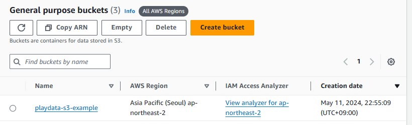
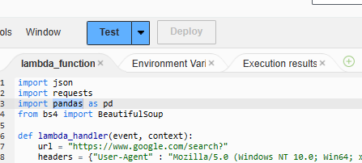
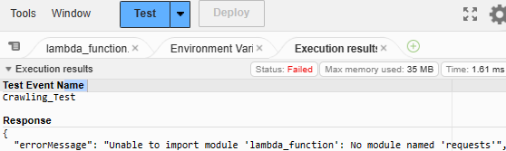

AWS 람다 크롤링 -> S3 / RDB 저장 -> 스케줄러 -> 슬랙 에러 전송

람다: 서버리스 컴퓨터  

실무 사용 사례
- 시스템 운영 자동화
- 실시간 파일 처리 (S3에 파일이 들어오면 자동으로)

# 목차
- [람다 함수 생성](#람다-함수-생성)
- [람다 모듈 추가](#람다에-모듈-추가)


## [람다 함수 생성](#목차)


`event`: 정보가 포함된 dict 타입의 객체  
`context`: 람다 함수의 실행 환경 및 런타임 정보

```py
import json

def lambda_handler(event, context):
    # TODO implement
    return {
        "event" : event,
        "context" : str(context),
    }
```

`key`:`value` 형태의 데이터를 받아서 `event`에 전달 -> event["key"]로 조회





코드 실행시간이 3초가 넘으면 에러 발생  
-> 설정 편집


메모리 및 시간 설정 (최대 15분)  
(메모리 10240 하려면 AWS 따로 요청)

lambda_function.py

```py
import json
import requests
import pandas as pd
from bs4 import BeautifulSoup

def lambda_handler(event, context):
    url = "https://www.google.com/search?"
    headers = {"User-Agent" : "Mozilla/5.0 (Windows NT 10.0; Win64; x64) AppleWebKit/537.36 (KHTML, like Gecko) Chrome/124.0.0.0 Safari/537.36"}
    
    df = pd.DataFrame(columns=["q","title","href"])
    q_lst = ["python", "AWS"]

    for i in range(len(q_lst)):
        params = {"q" : q_lst[i]}
        res = requests.get(url,params=params,headers=headers)
        if res.status_code == 200:
            
            dom = BeautifulSoup(res.text, "html.parser")
            title = [_.text for _ in dom.select("h3.LC20lb")]
            href = [_["href"] for _ in dom.find_all("a", attrs={"jsname":"UWckNb"})]
            df_new = pd.DataFrame({"q":q_lst[i], "title":title, "href":href})
            df = pd.concat([df,df_new], ignore_index=True)        
        
    return {
        "df" : df.groupby("q").head(1).to_dict(orient="list")
    }
```
> 코드 설명  
> 구글 - python, AWS 검색 -> 게시글, 주소 수집



변경사항 Deploy 후 Test


테스트 이벤트 생성 Save -> Test



-> requests 모듈이 없다는 에러 발생  
-> `requests`, `pandas`, `bs4` 모듈 없음

# [람다에 모듈 추가](#목차)

cmd 또는 vscode terminal에서

> conda search python  
> python 3.12 버전이 없다면  
> conda update conda

```sh
> conda create -n lambda python=3.12 -y
> conda activate lambda
(lambda) > mkdir python && cd python
(lambda) python > pip install requests bs4 -t .
```

`pandas`는 람다에서 자체적으로 제공함


해당 모듈들을 압축  

dist-info 폴더들, README는 삭제해도 무방  
-> 모듈 버전 확인용


Lambda > Layers 이동 후 Create layer


아까 압축한 파일 업로드 후 Create  
(50MB 넘으면 안됨)


Version ARN 복사


Layers 클릭


Add a layer


AWS layers - AWSSDKPandas-Python312 - 8  
람다에서 제공하는 판다스 모듈 추가


Specify an ARN - ARN 주소 붙여넣기 - Verify  
requests, bs4 모듈 추가


Test 결과

