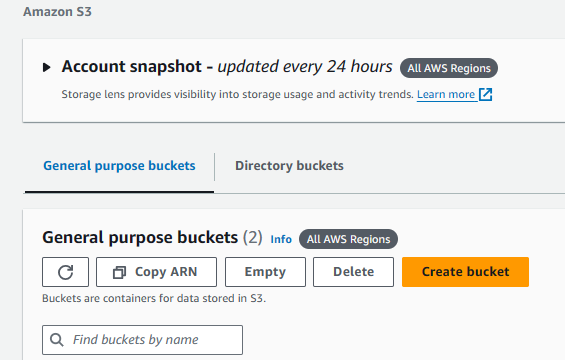
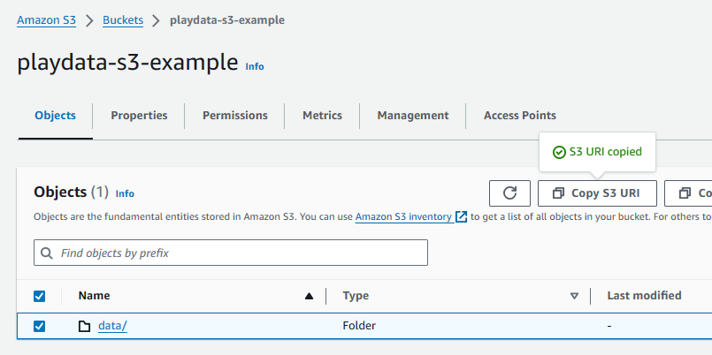
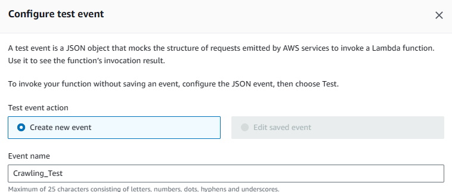

# Local



라이브러리 추가


application.yaml 설정


Entity 정의 -> 테이블 자동 생성  
빌드 시작


# EC2






ec2 생성


콘솔창 접속

```sh
sudo apt-get -y update
sudo apt-get -y upgrade
sudo apt-get -y dist-upgrade
sudo apt-get install -y vim wget unzip ssh openssh-* net-tools

sudo apt-get install mysql-client -y

sudo mysql -u root -h "RDS Endpoint 주소" -P 3306 -prootroot
```


