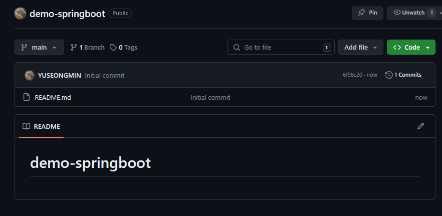
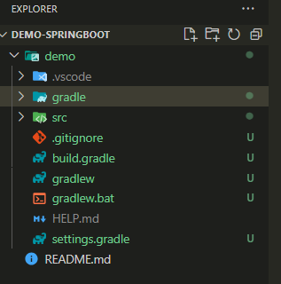
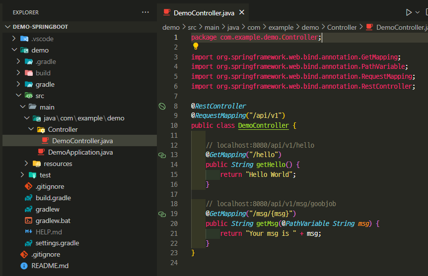

깃허브 레파지토리 생성

깃 클론

자바 gradle 프로젝트

spring web, lombok 추가



spring boot와 깃허브 연동



commit 반영

docker 실행 후 Dockerfile 생성

<details><summary>Dockerfile 코드
</summary>

```sh
FROM gradle:7.6-jdk17-alpine as build

ENV APP_HOME=/apps

WORKDIR $APP_HOME

COPY ./demo/build.gradle ./demo/settings.gradle ./demo/gradlew $APP_HOME

COPY ./demo/gradle $APP_HOME/gradle

RUN chmod +x gradlew

RUN ./gradlew build || return 0

COPY ./demo/src $APP_HOME/src

RUN ./gradlew clean build

FROM openjdk:17.0.2-jdk

ENV APP_HOME=/apps
ARG ARTIFACT_NAME=app.jar
# ARG JAR_FILE_PATH=build/libs/[프로젝트명]-0.0.1-SNAPSHOT.jar 
ARG JAR_FILE_PATH=build/libs/demo-0.0.1-SNAPSHOT.jar 

WORKDIR $APP_HOME

COPY --from=build $APP_HOME/$JAR_FILE_PATH $ARTIFACT_NAME

EXPOSE 8080

#ENTRYPOINT ["java", "-XX:+UnlockExperimentalVMOptions", "-XX:+UseCGroupMemoryLimitForHeap", "-Djava.security.egd=file:/dev/./urandom", "-jar", "app.jar"]
ENTRYPOINT ["java", "-jar", "app.jar"]
```

</details>

