깃허브 레파지토리 생성

깃 클론

자바 gradle 프로젝트

spring web, lombok 추가


spring boot와 깃허브 연동


commit 반영

docker 실행 후 Dockerfile 생성

<details><summary>Dockerfile 코드
</summary>

```sh
FROM gradle:7.6-jdk17-alpine as build

ENV APP_HOME=/apps

WORKDIR $APP_HOME

COPY ./demo/build.gradle ./demo/settings.gradle ./demo/gradlew $APP_HOME

COPY ./demo/gradle $APP_HOME/gradle

RUN chmod +x gradlew

RUN ./gradlew build || return 0

COPY ./demo/src $APP_HOME/src

RUN ./gradlew clean build

FROM openjdk:17.0.2-jdk

ENV APP_HOME=/apps
ARG ARTIFACT_NAME=app.jar
# ARG JAR_FILE_PATH=build/libs/[프로젝트명]-0.0.1-SNAPSHOT.jar 
ARG JAR_FILE_PATH=build/libs/demo-0.0.1-SNAPSHOT.jar 

WORKDIR $APP_HOME

COPY --from=build $APP_HOME/$JAR_FILE_PATH $ARTIFACT_NAME

EXPOSE 8080

#ENTRYPOINT ["java", "-XX:+UnlockExperimentalVMOptions", "-XX:+UseCGroupMemoryLimitForHeap", "-Djava.security.egd=file:/dev/./urandom", "-jar", "app.jar"]
ENTRYPOINT ["java", "-jar", "app.jar"]
```
</details>


Dockerfile 빌드


```sh
docker build -f .\Dockerfile -t dome-container:latest .
```

빌드 성공 후 commit


aws codebuild을 하려면 깃허브에 코드가 완성되어야
그리고 그 결과를 저장할 ECR도

ECR은 컨테이너 저장소 (이미지 저장소)
도커 허브와 차이점
도커 허브는 퍼블릭

ECR 생성

Amazon Elastic Container Registry


이미지 없음

buildspec.yml 파일 생성

구조 설명
env: 환경변수
phases
build

env: 자주 쓰는 주소들 변수 설정

git-credential-helper: 깃에 접속할 수 있는 코드
ECS_CONTAINER_NAME: ecs 컨테이너 이름

phases
코드 설명은 공식 사이트 참고


```sh
REPOSITORY_URI=$AWS_ACCOUNT_ID.dkr.ecr.$AWS_DEFAULT_REGION.amazonaws.com/$IMAGE_REPO_NAME:$IMAGE_TAG
```

build

```sh
docker build -f ./Dockerfile -t $IMAGE_REPO_NAME:$IMAGE_TAG .
```

도커 파일로 이미지 빌드

post_build

      - printf '[{"name":"%s","imageUri":"%s"}]' $ECS_CONTAINER_NAME $REPOSITORY_URI > imagedefinitions.json

imagedefinitions.json 파일 생성

artifacts

imagedefinitions.json 배포


## AWS codepipeline

코드 파이프라인에는 3단계로 구성

깃허브, 코드빌드 , deploy


깃허브와 코드 파이프라인과 연결


Install new app


이후 connect


Build projects 


Confirm


Role name 기억

codebuild-demo-build-yuseongmin-service-role

Buildspec


직접 명령어로 쳐서 빌드할거면 첫번째

파일로 만든게 있으면 두번째

path를 안 쓴 이유는 root 경로 미리 정의해서

create build 

## IAM 


배포는 EMR에서 하는데 EMR 접근 권한이 없음
그래서 EMR 권한 추가


Attach policy
AmazonEC2ContainerRegistryPowerUser 추가

## 코드 파이프라인


Start Now
buildspec.yml 실행
빌드 스펙이 정상적으로 작동되면 ECS에 생성


ECR 만든 후 CodeDeploy 배포

다 완료하면
springboot에서 수정 후 커밋하면
ECR에 자동으로 반영

## Amazon Elastic Container Service

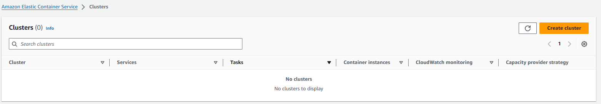

Create cluster 

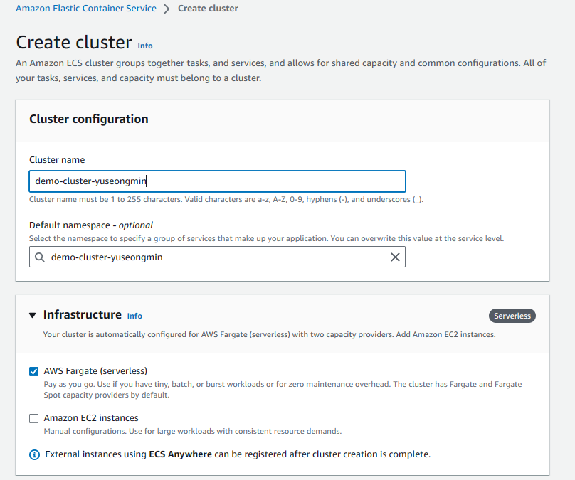


Task definitions

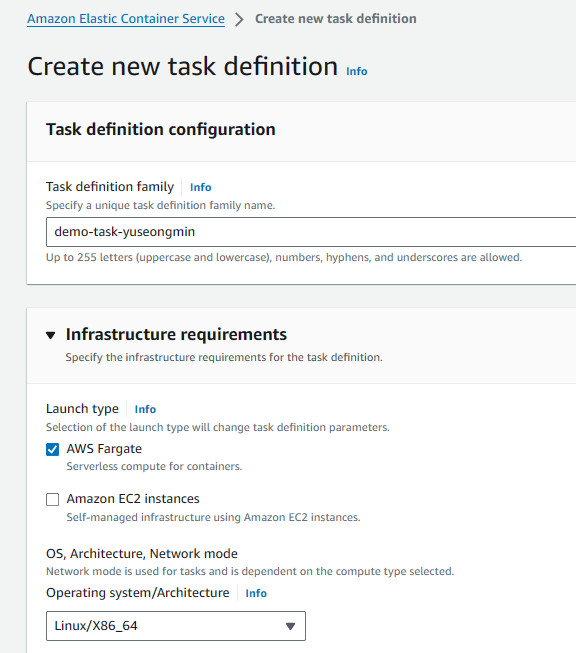

task role
작업할 때 필요한 권한


task execution role
생성할 때 필요한 권한
ECR 이미지 가져오기 권한

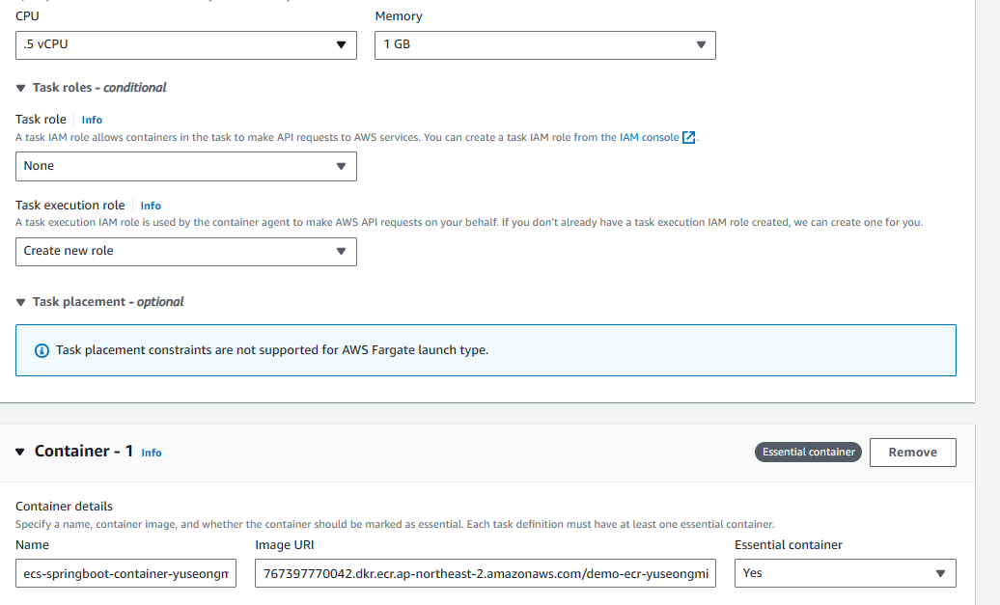


buildspec.yml 파일에 정의한
ECS_CONTAINER_NAME

ecs-springboot-container-yuseongmin

Image URL
ECR 레파지토리 주소

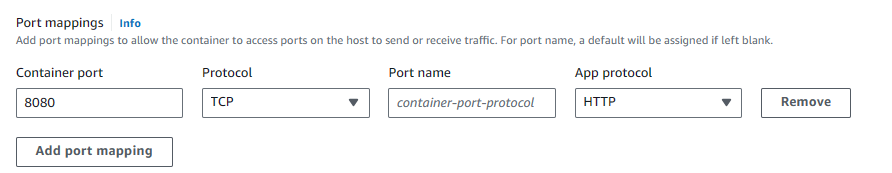

포트 변경


HealthCheck 
작동이 잘 되었는지 판단
```
CMD-SHELL,curl -f http://localhost:8080/api/v1/hello || exit 1
```

ECS

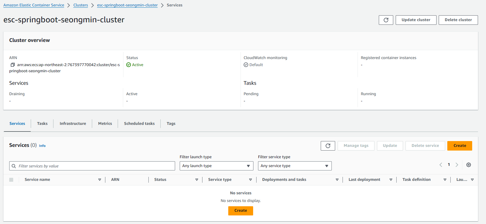


service 생성

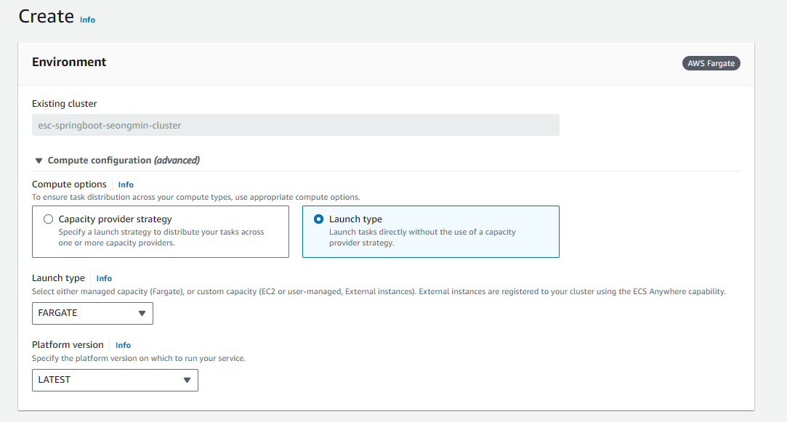


Servic는 2가지 타입
24시간 항상 떠있는 웹은 서비스로

특정 프로그램이 끝나면 종료 (배치 프로그램) -> Task

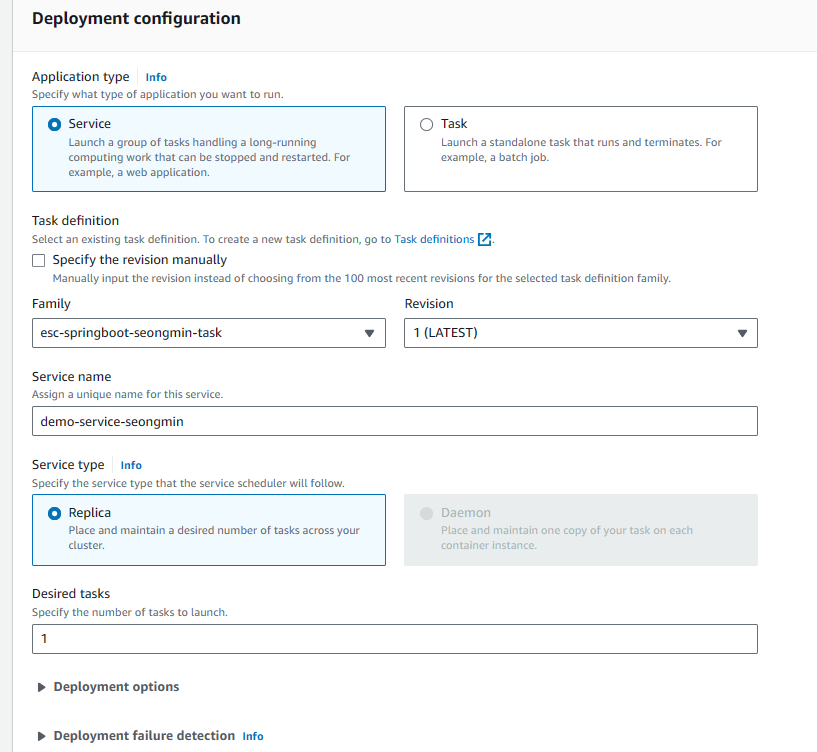

Spring은 웹 서비스 -> Service
Desired task
정해진 숫자만큼 생성, 삭제

EC2 - Security Groups

default
인바운드 룰
custom tcp 8080 0.0.0.0/0 추가

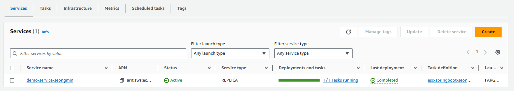

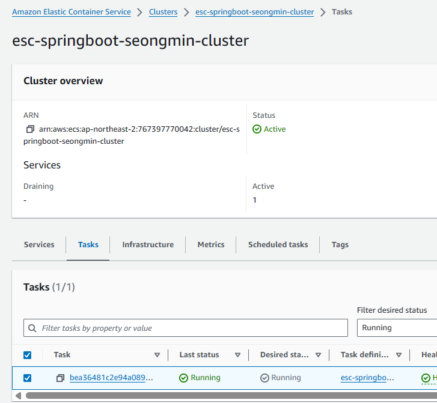

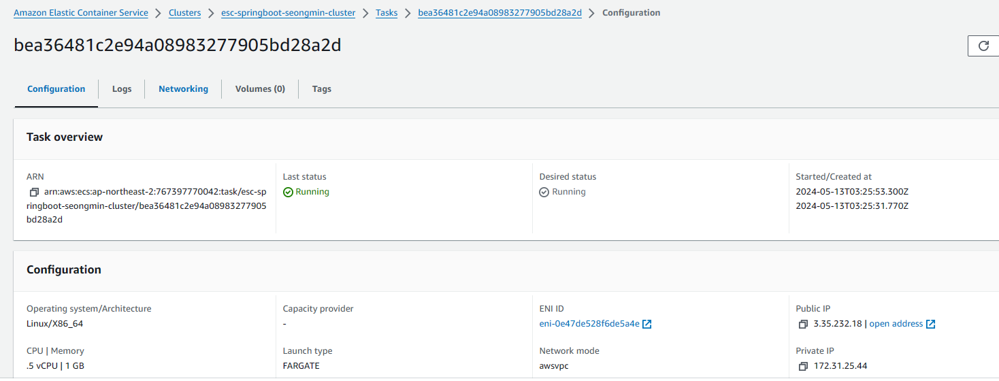


http://{public ip}:8080/api/v1/hello

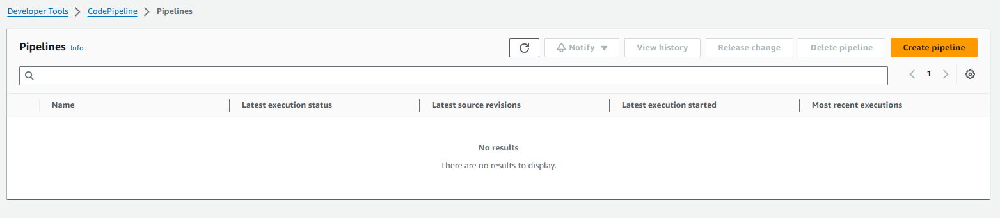

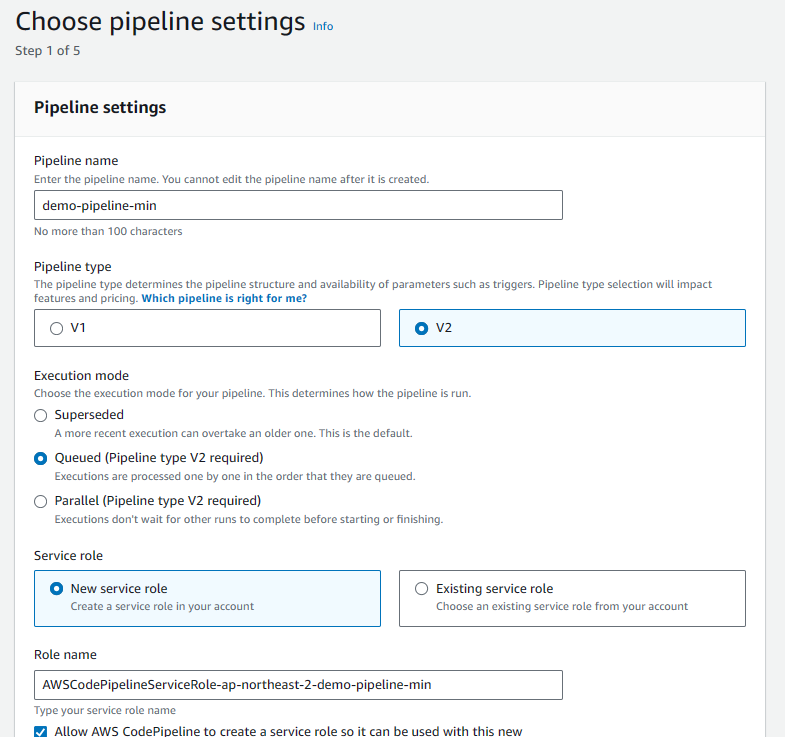

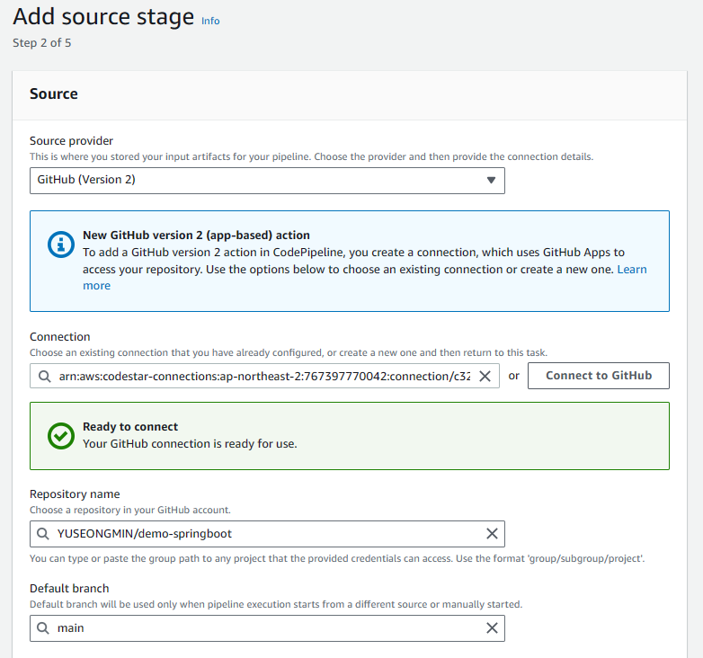

main 브랜치 권한이 있는 사람만 배포 가능
완벽하게 로컬 테스트가 작동하고 소스코드가 깔끔할 때만 배포

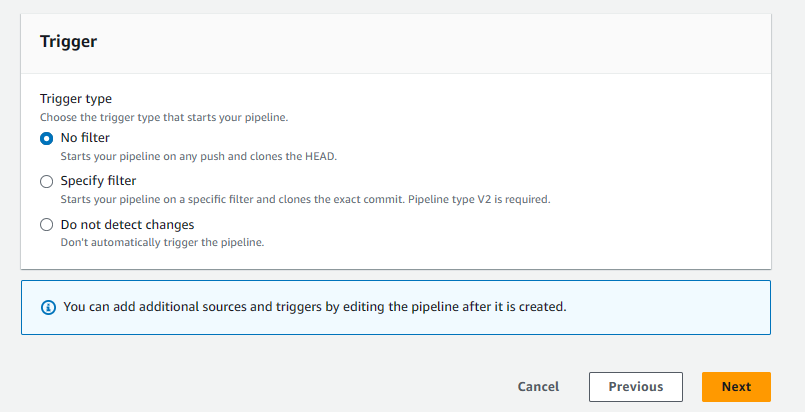

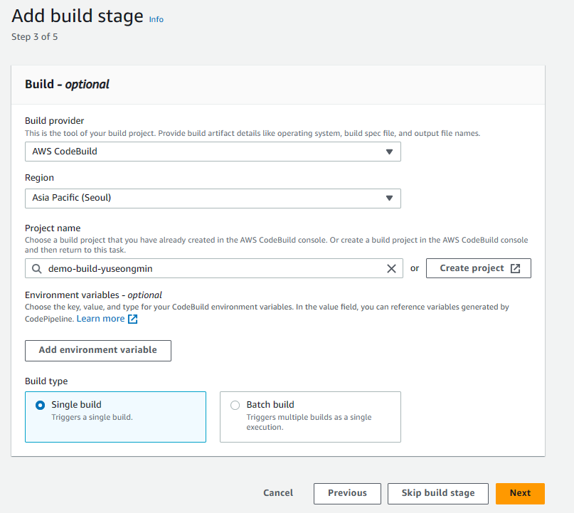

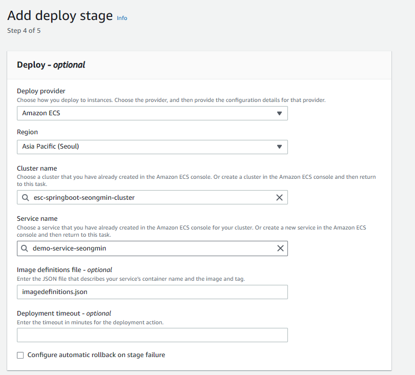

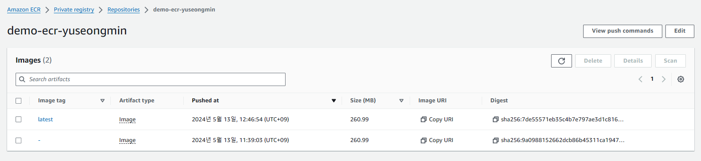


