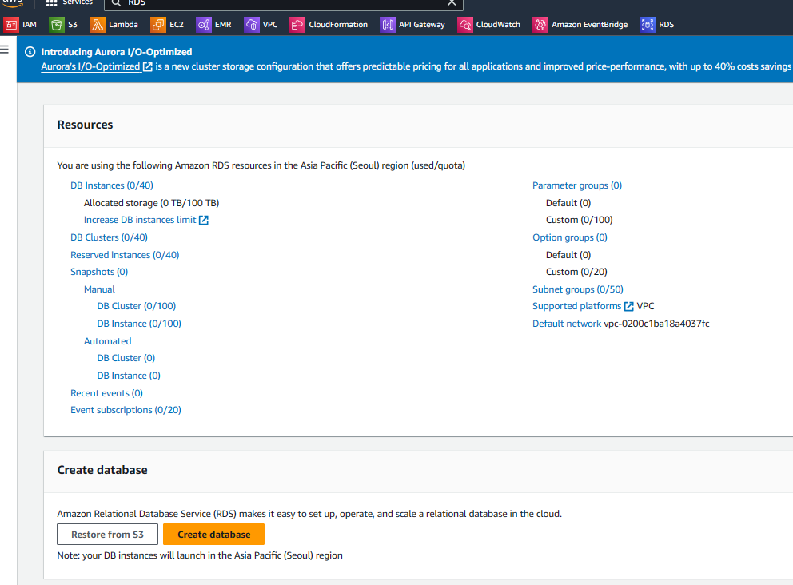

create database

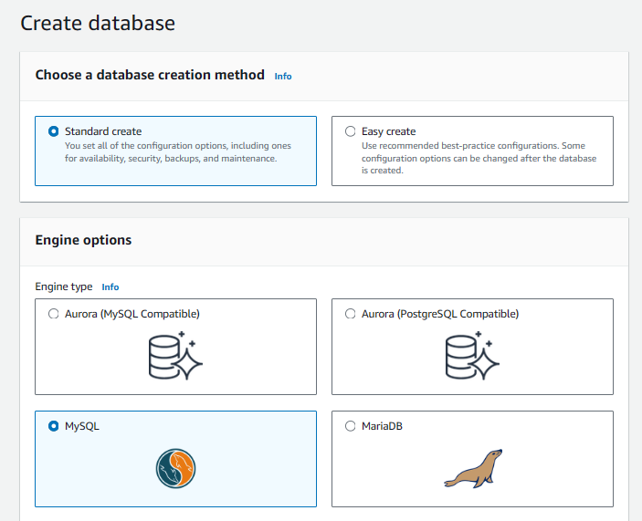

mysql

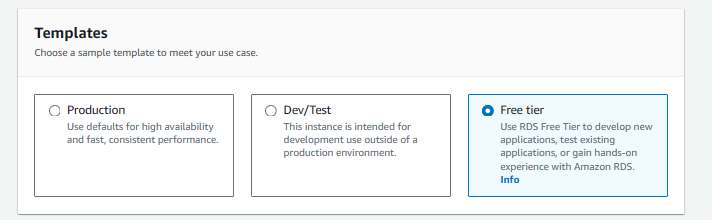

free tier

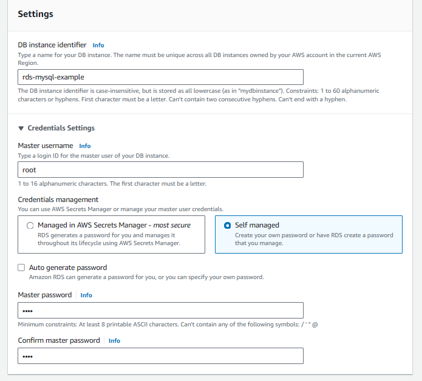

root/rootroot

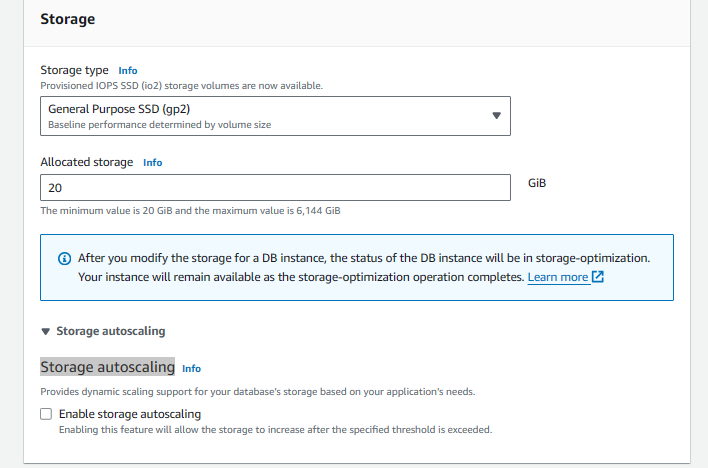

Storage autoscaling 해제 (과금방지)

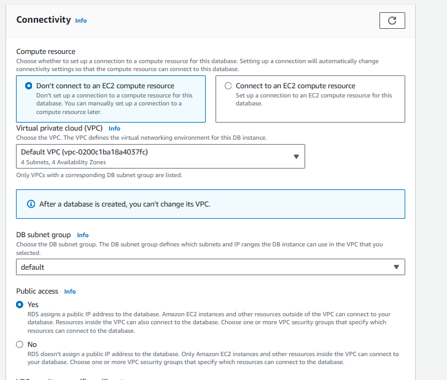

public access (로컬에서도 접속)

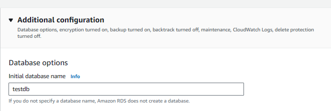

초기 db 이름

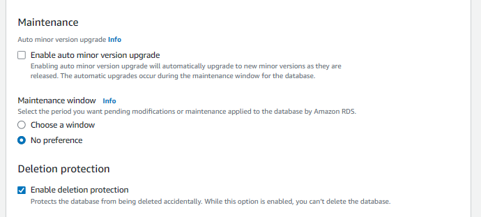

자동 업데이트 방지  
데이터베이스 실수로 삭제 방지

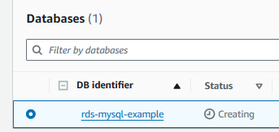

creating

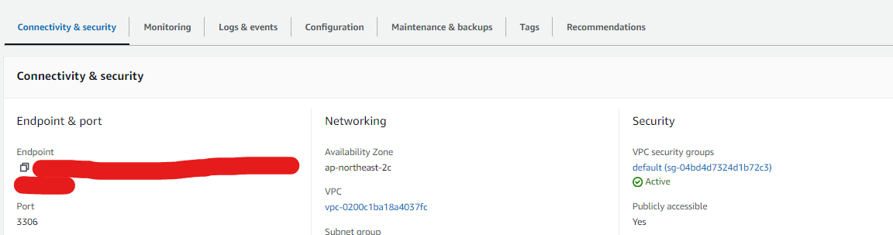

security 설정

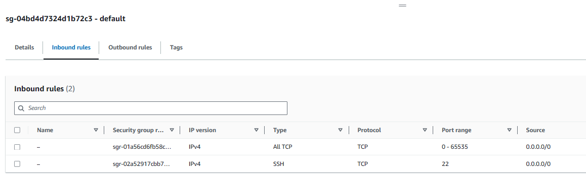

인바운드 all tcp 추가  
(로컬 접속)

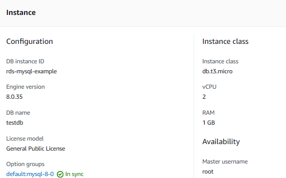
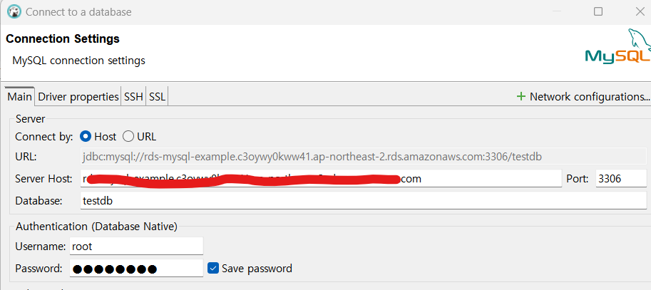

Server Host: Endpoint  
Database: 초기db 이름  
root/rootroot  

allowPublicKeyRetrieval: TRUE  

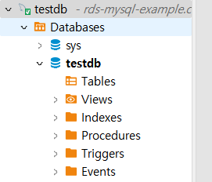
